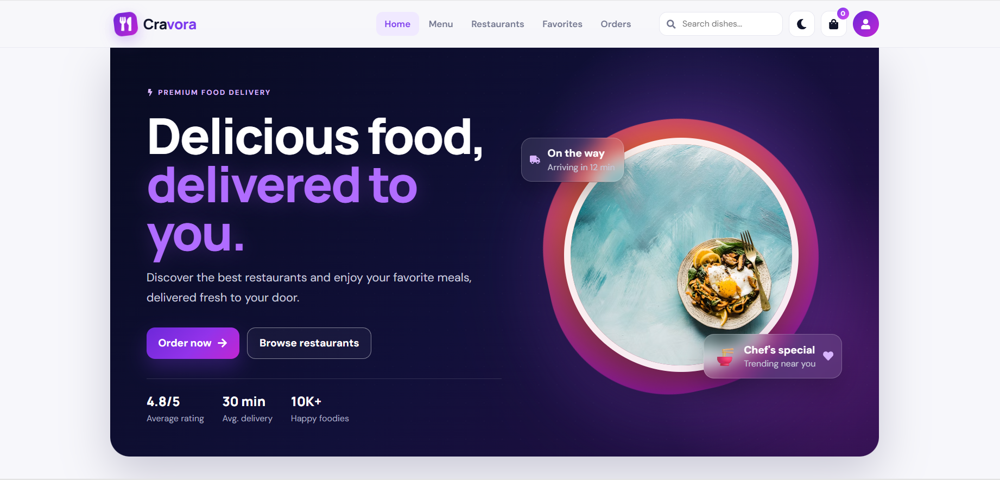
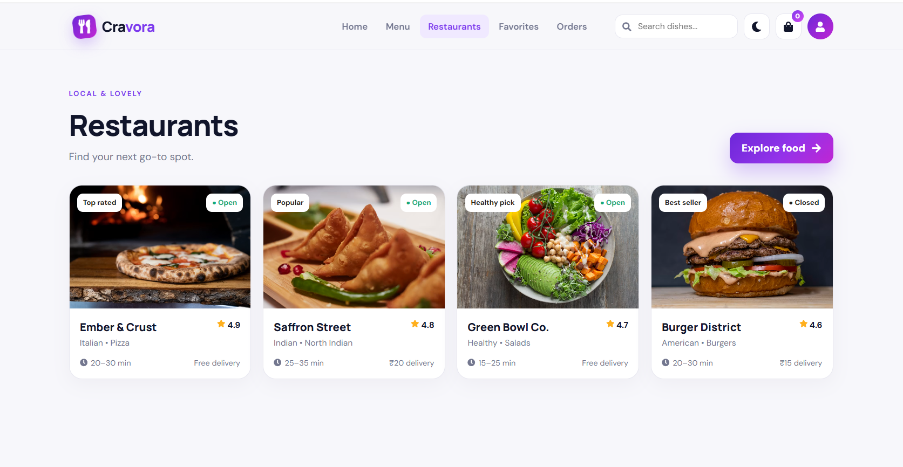
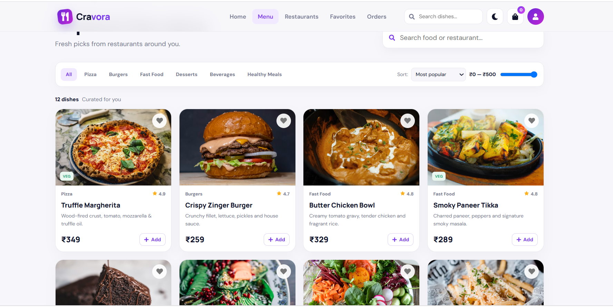
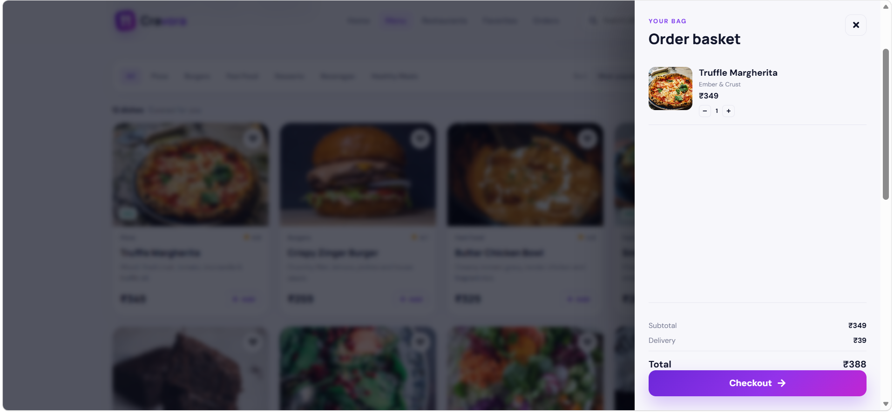
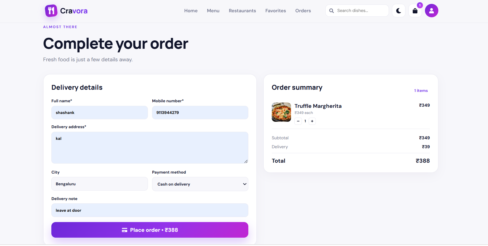
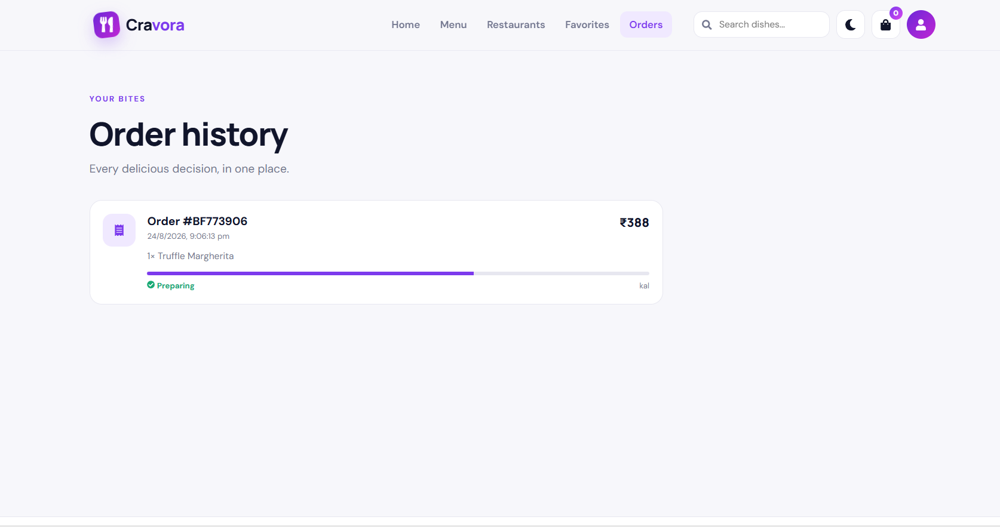
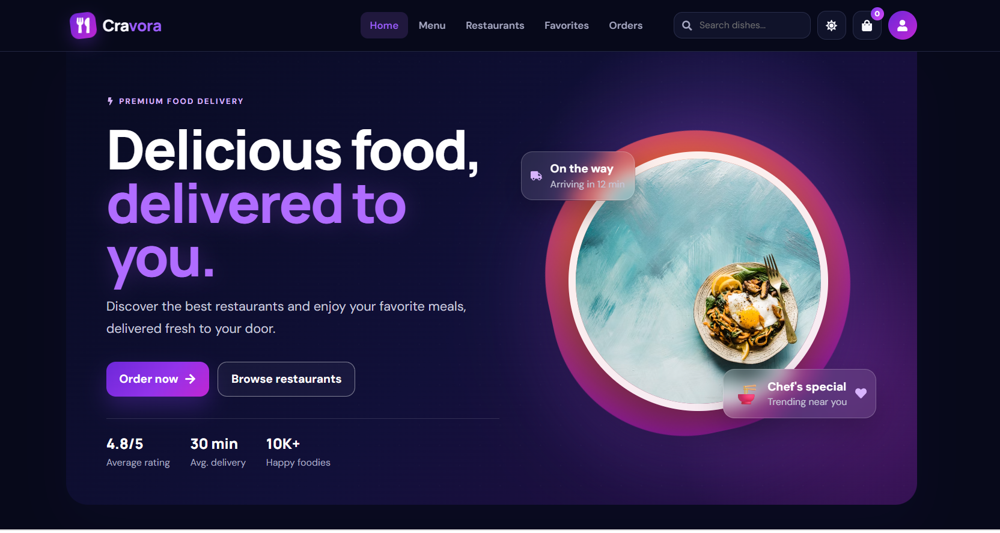
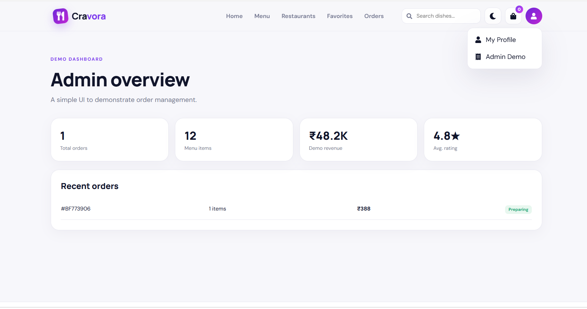

# 🍽️ CRAVORA — Food Delivery System

<p align="center">
  <strong>Crave it. Tap it. Enjoy it.</strong>
</p>

<p align="center">
  A modern, responsive and interactive food delivery web application built with React and Vite.
</p>

<p align="center">


</p>

---

## 🌟 About the Project

**CRAVORA** is a modern food delivery web application designed to provide users with a smooth, attractive and interactive online food ordering experience.

The application allows users to discover restaurants, explore food items, search and filter menus, manage a shopping cart, save favorite foods, complete an order form, select payment methods and track their orders.

CRAVORA focuses on practical frontend development concepts including React components, state management, dynamic rendering, form validation, responsive design and browser-based data persistence.

The interface follows a premium **deep navy, violet and lavender** visual theme with modern cards, gradients, glassmorphism effects and smooth interactions.

---

# 🎯 Project Objectives

The main objectives of CRAVORA are to demonstrate:

* Frontend development skills
* React application development
* Modern UI/UX design
* Responsive web design
* State and data management
* Search and filtering functionality
* Shopping cart implementation
* Form handling and validation
* LocalStorage data persistence
* Real-world application structuring
* Interactive user experiences
* Problem-solving and application development

---

# ✨ Features

## 🏠 1. Modern Homepage

The homepage includes:

* Premium hero section
* CRAVORA branding
* Food-focused visual design
* Call-to-action buttons
* Popular restaurants
* Featured food items
* Food categories
* Promotional offers
* Responsive layout

---

## 🏪 2. Restaurant Discovery

Users can explore restaurants with information such as:

* Restaurant name
* Restaurant image
* Cuisine type
* Rating
* Delivery time
* Availability
* Restaurant details

The restaurant interface uses responsive cards with interactive hover effects.

---

## 🍕 3. Food Menu

Food items include:

* Food image
* Food name
* Category
* Price
* Description
* Rating
* Add to Cart button

Food categories include:

* Pizza
* Burgers
* Fast Food
* Desserts
* Beverages
* Healthy Meals

---

## 🔎 4. Search & Filtering

Users can search and discover food quickly.

### Search

* Search food by name
* Search restaurants by name

### Filters

* Filter by food category
* Filter by price
* Sort by rating
* Sort by popularity

Results update dynamically based on user interaction.

---

## 🛒 5. Shopping Cart

The cart management system allows users to:

* Add food items
* Increase quantity
* Decrease quantity
* Remove individual items
* Clear the cart
* View subtotal
* View delivery charge
* View total amount

All calculations update dynamically.

---

## ❤️ 6. Wishlist / Favorites

Users can save favorite food items.

Features include:

* Add food to wishlist
* Remove food from wishlist
* View favorite items
* Persistent wishlist data

Wishlist information is stored using LocalStorage.

---

## 📝 7. Food Ordering Form

The checkout system allows users to enter:

* Customer name
* Contact information
* Delivery address
* Payment method
* Order information

Basic frontend validation is included to prevent incomplete submissions.

---

## 💳 8. Payment UI

CRAVORA includes a frontend payment interface with options such as:

* Credit/Debit Card
* UPI
* Cash on Delivery

> **Note:** This is a frontend payment interface for demonstration purposes. No real financial transactions are processed.

---

## 🧾 9. Order Summary

After placing an order, users can review:

* Ordered food items
* Quantities
* Customer information
* Delivery address
* Payment method
* Subtotal
* Delivery charge
* Total amount
* Order confirmation

---

## 🚚 10. Order Tracking

CRAVORA includes an order tracking interface showing the order progress.

Example flow:

```text
Order Confirmed
      ↓
Food Preparing
      ↓
Out for Delivery
      ↓
Delivered
```

This provides a realistic food delivery experience.

---

## 📜 11. Order History

Users can view previous orders including:

* Order details
* Food items
* Quantities
* Total amount
* Order status
* Order information

---

## 👤 12. User Profile

The profile interface provides access to:

* User information
* Order history
* Favorite foods
* Account-related options
* Saved preferences

---

## 🌙 13. Dark Mode

CRAVORA includes a dedicated dark mode with a premium dark interface.

The design maintains:

* Readability
* Consistent spacing
* Proper contrast
* Attractive gradients
* Interactive elements

The selected theme can be persisted using LocalStorage.

---

## ⚙️ 14. Admin Dashboard

CRAVORA also includes an admin dashboard UI.

The dashboard provides interfaces for:

* Overview statistics
* Restaurant management
* Food management
* Order overview
* User overview
* Application management

The admin dashboard demonstrates how the frontend can be extended into a larger food delivery platform.

---

## 💾 15. LocalStorage

CRAVORA uses browser LocalStorage to preserve important application data.

Stored information can include:

* Cart items
* Wishlist items
* Orders
* Theme preference
* User preferences

This allows data to remain available even after refreshing the browser.

---

# 🎨 UI / UX Design

CRAVORA uses a distinctive premium interface instead of the traditional red/orange food delivery theme.

## 🎨 Color Palette

| Color           | Purpose                             |
| --------------- | ----------------------------------- |
| Deep Navy       | Main background                     |
| Electric Violet | Primary accent                      |
| Purple Gradient | Hero and buttons                    |
| Soft Lavender   | Secondary surfaces                  |
| White           | Main text and cards                 |
| Magenta         | Highlights and promotional elements |

## ✨ Design Concepts

The interface uses:

* Modern gradients
* Glassmorphism
* Rounded cards
* Soft shadows
* Glow effects
* Smooth transitions
* Hover animations
* Modern typography
* Responsive layouts
* Interactive UI elements

---

# 📱 Responsive Design

CRAVORA is designed to work across multiple devices.

### Supported layouts

* 📱 Mobile
* 📲 Tablet
* 💻 Laptop
* 🖥️ Desktop

The interface automatically adapts to different screen sizes.

---

# 🛠️ Technologies Used

| Technology   | Purpose                       |
| ------------ | ----------------------------- |
| React.js     | Frontend application          |
| Vite         | Development and build tool    |
| JavaScript   | Application logic             |
| HTML5        | Page structure                |
| CSS3         | Styling and responsive design |
| React Icons  | Interface icons               |
| LocalStorage | Client-side data persistence  |

---

# 📂 Project Structure

```text
cravora-food-delivery-system/
│
├── public/
│
├── screenshots/
│   ├── home.png
│   ├── restaurants.png
│   ├── menu.png
│   ├── cart.png
│   ├── checkout.png
│   ├── order-tracking.png
│   ├── dark-mode.png
│   └── admin-dashboard.png
│
├── src/
│   ├── main.jsx
│   └── styles.css
│
├── .gitignore
├── index.html
├── package.json
├── README.md
└── package-lock.json
```

---

# 🔄 Application Flow

```text
                    CRAVORA
                       │
                       ▼
                    Homepage
                       │
             ┌─────────┴─────────┐
             ▼                   ▼
        Restaurants          Food Menu
             │                   │
             └─────────┬─────────┘
                       ▼
                Search / Filter
                       │
                       ▼
                  Food Details
                       │
                       ▼
                   Add to Cart
                       │
                       ▼
                  Shopping Cart
                       │
                       ▼
                    Checkout
                       │
                       ▼
                Payment Selection
                       │
                       ▼
                Order Confirmation
                       │
                       ▼
                 Order Tracking
                       │
                       ▼
                  Order History
```

---

# 🧩 Application Modules

## Customer Module

* Homepage
* Restaurant discovery
* Food menu
* Search
* Filters
* Cart
* Wishlist
* Checkout
* Payment UI
* Order confirmation
* Order tracking
* Order history
* Profile
* Dark mode

## Admin Module

* Dashboard
* Restaurant management UI
* Food management UI
* Order overview
* User overview
* Statistics

---

# 🔐 Form Validation

The ordering form provides basic frontend validation for:

* Customer name
* Contact information
* Delivery address
* Required checkout fields
* Payment selection

Validation helps prevent incomplete order submissions.

---

# 🧠 Key React Concepts Demonstrated

This project demonstrates practical usage of:

* React components
* JSX
* State management
* Props
* Event handling
* Conditional rendering
* Dynamic lists
* Array methods
* Search functionality
* Filtering
* Sorting
* Cart calculations
* Form handling
* Form validation
* LocalStorage
* UI state
* Responsive layouts

---

# 📸 Screenshots

## 🏠 Home Page



---

## 🏪 Restaurant Discovery



---

## 🍕 Food Menu



---

## 🛒 Shopping Cart



---

## 💳 Checkout



---

## 🚚 Order Tracking



---

## 🌙 Dark Mode



---

## ⚙️ Admin Dashboard



---

# 🚀 Installation & Setup

## Prerequisites

Before running CRAVORA, install:

* Node.js
* npm
* Visual Studio Code
* Git

---

## 1. Clone the Repository

```bash
git clone https://github.com/YOUR-USERNAME/cravora-food-delivery-system.git
```

---

## 2. Navigate to the Project

```bash
cd cravora-food-delivery-system
```

---

## 3. Install Dependencies

```bash
npm install
```

---

## 4. Start the Development Server

```bash
npm run dev
```

The application will normally run at:

```text
http://localhost:5173
```

Open the URL in your browser.

---

# 🏗️ Build for Production

To create a production build:

```bash
npm run build
```

To preview the production build locally:

```bash
npm run preview
```

---

# 🌐 Live Demo

🚀 **Live Application:**

> Coming soon — deployment will be added after the project is hosted.

---

# 📌 Project Information

| Information  | Details                       |
| ------------ | ----------------------------- |
| Project Name | CRAVORA                       |
| Project Type | Food Delivery Web Application |
| Category     | Frontend Web Development      |
| Framework    | React                         |
| Build Tool   | Vite                          |
| Styling      | CSS3                          |
| Data Storage | LocalStorage                  |
| Design       | Responsive UI/UX              |
| Status       | Completed                     |

---

# 🎓 Learning Outcomes

Through this project, the following practical skills were developed:

* React frontend development
* Modern UI/UX design
* Responsive web development
* JavaScript programming
* State management
* Dynamic application rendering
* Search and filtering
* Shopping cart logic
* Form validation
* LocalStorage
* Component-based development
* Git and GitHub
* Project deployment

---

# 🔮 Future Enhancements

Future versions of CRAVORA could include:

* Real backend integration
* User authentication
* Restaurant owner accounts
* Real restaurant database
* REST API integration
* Node.js/Express backend
* MongoDB/MySQL database
* Real-time order tracking
* Google Maps integration
* Delivery partner application
* Real payment gateway
* Push notifications
* Cloud deployment
* Real-time restaurant availability
* Advanced admin analytics

---

# 🤝 Contributing

Contributions and suggestions are welcome.

If you would like to improve the project:

1. Fork the repository
2. Create a new branch
3. Make your changes
4. Commit your changes
5. Push the branch
6. Create a Pull Request

---

# ⭐ Support

If you find this project useful or interesting, consider giving the repository a ⭐ on GitHub.

---

# 👨‍💻 Author

## Shashank Okali

**MCA Student | BCA Graduate | Web Developer**

### Technologies

* HTML
* CSS
* JavaScript
* React
* Python
* Django
* Git
* GitHub

---

# 📬 Project

**CRAVORA — Food Delivery System**

> **Crave it. Tap it. Enjoy it.** 🍽️💜

---

<p align="center">
  Built with ❤️ using React, JavaScript and CSS
</p>
